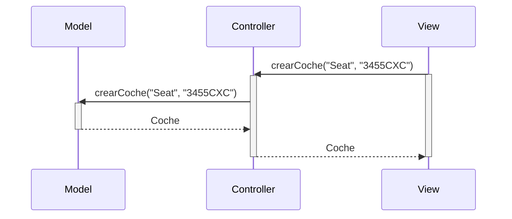
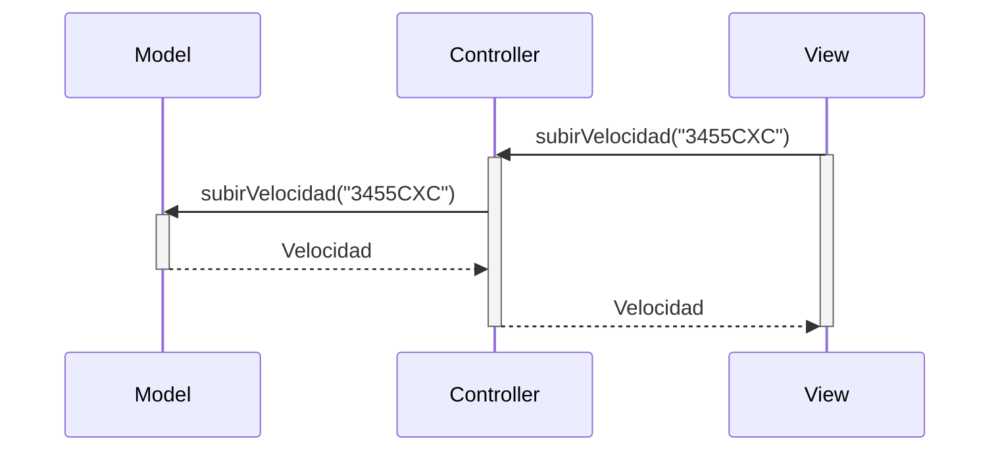
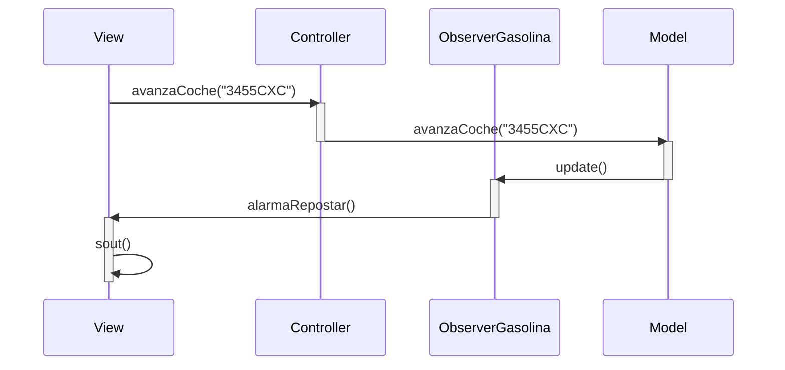
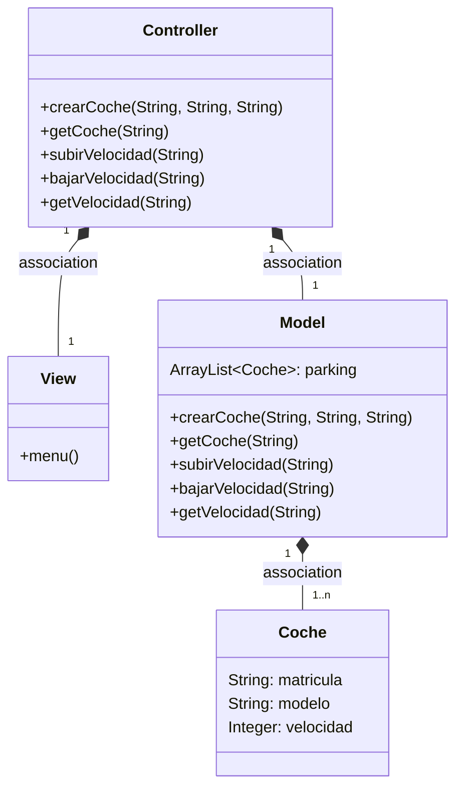

## Cambios realizados respecto a lo escrito en papel:
He hecho que los métodos tengan como parámetro la matrícula y he creado un método getLitros para que muestre los litros de gasolina.
En clase coche he inicializado las variables. Además, he realizado el javadoc. La velocidad no se tiene en cuenta, por lo que debe ser siempre la misma para que los métodos tengan sentido, en este caso 20 km/h.

## Explicación del Observer:
Los métodos avanzaCoche() y ponerGasolina() en el Controller llaman a los del Model, y los del Model llaman al método notifyObservers() que llama a la clase del Observer, la cual lanza el aviso en caso de que los litros de gasolina sean menores a 10. Cuando avanzo un kilómetro, en la consola me sale el aviso, ya que los litros de gasolina están inicializados a 10 (también la matrícula y los litros actuales). También sale en caso de que el usuario seleccione poner gasolina y esta sea menor a 10.

Aviso tras avanzar (y que queden menos de 10L):

Aviso tras repostar (y que aún no se llegue a los 10L):

## Diagramas de secuencia:

crearCoche():

subirVelocidad():

avanzaCoche() con el observer:

---
## Diagrama de clases:

---

