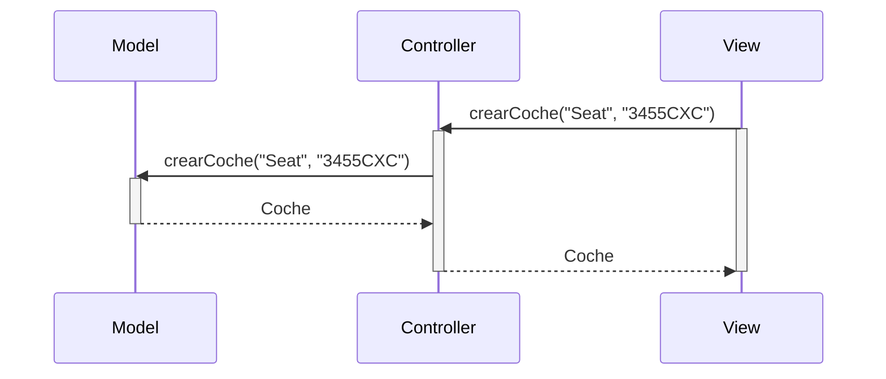
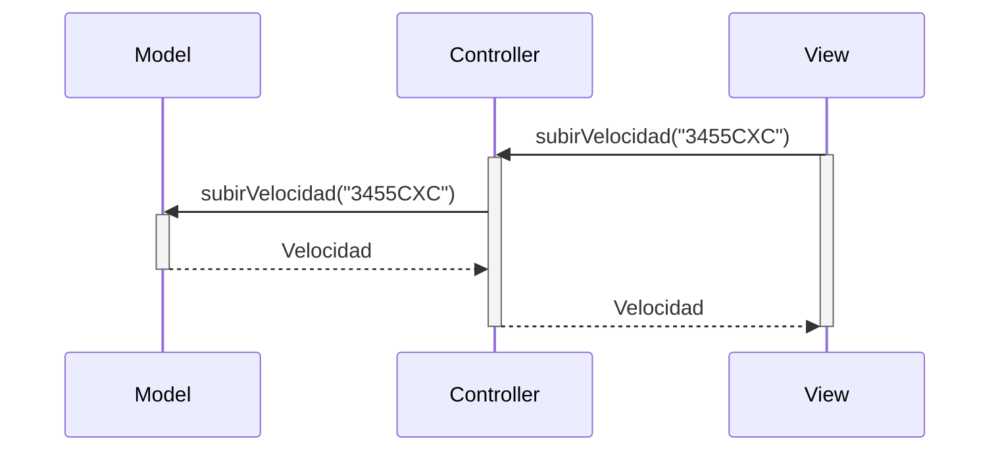

```mermaid
sequenceDiagram
    participant Model
    participant Controller
    participant View

    
    View->>Controller: crearCoche("Seat", "3455CXC")
    activate View
    activate Controller
    Controller->>Model: crearCoche("Seat", "3455CXC")
    activate Model
    Model-->>Controller: Coche
    deactivate Model
    Controller-->>View: Coche
    deactivate Controller
    deactivate View

```

```mermaid
sequenceDiagram
    participant Model
    participant Controller
    participant View

    View->>Controller: subirVelocidad("3455CXC")
    activate View
    activate Controller
    Controller->>Model: subirVelocidad("3455CXC")
    activate Model
    Model-->>Controller: Velocidad
    deactivate Model
    Controller-->>View: Velocidad
    deactivate Controller
    deactivate View
    
```
