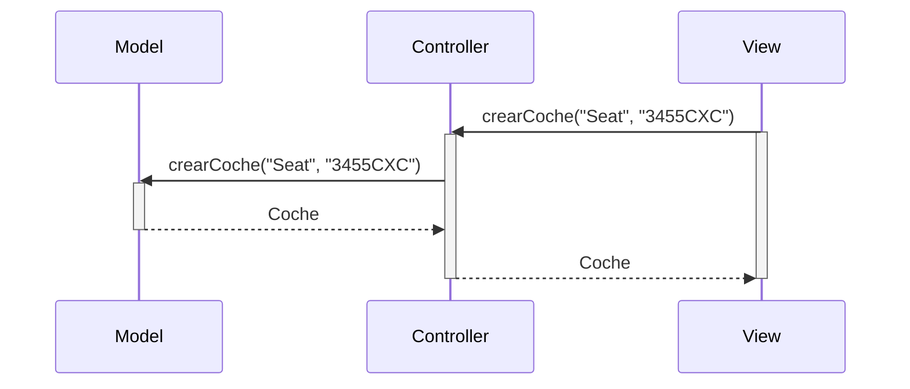
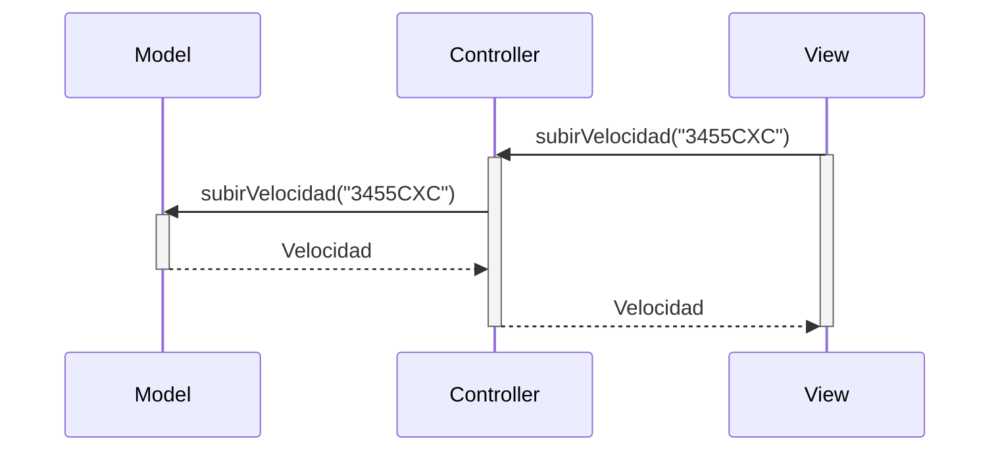
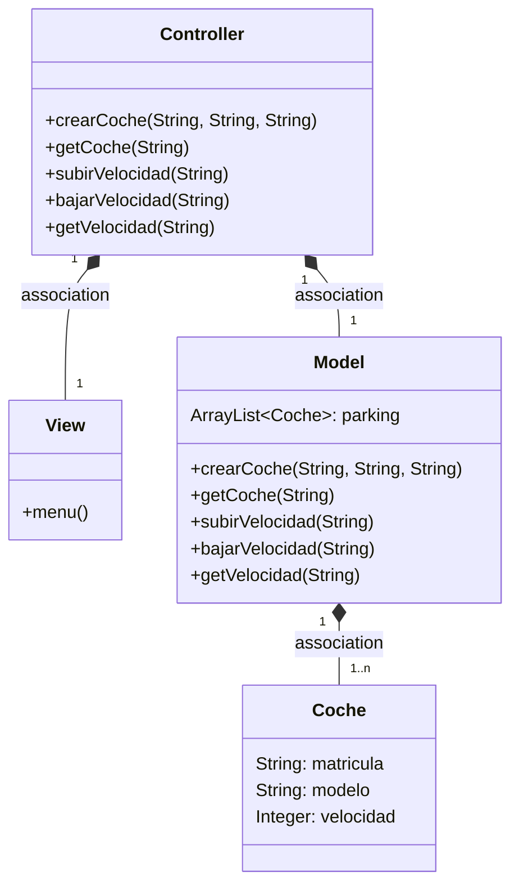

## Cambios realizados respecto a lo escrito:
He hecho que los métodos tengan como parámetro la matrícula y he creado un método getLitros para que muestre los litros de gasolina.
En clase coche he inicializado las variables. Además, he realizado el javadoc. La velocidad no se tiene en cuenta, por lo que debe ser siempre la misma para que los métodos tengan sentido, en este caso 20 km/h.

## Diagrama de secuencia:

---
## Diagrama de clases:

---

