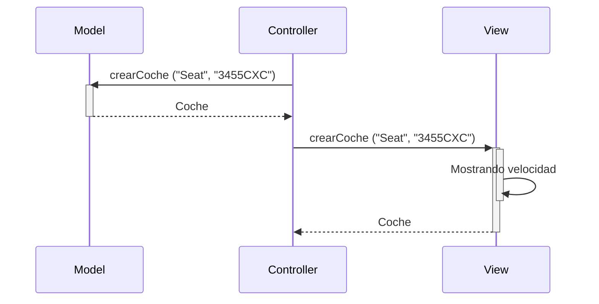

```mermaid
sequenceDiagram
    participant Model
    participant Controller
    participant View
    Controller->>Model: crearCoche ("Seat", "3455CXC")
    activate Model
    Model-->>Controller: Coche
    deactivate Model
    Controller->>+View: crearCoche ("Seat", "3455CXC")
    activate View
    View->>-View: Mostrando velocidad
    View-->>Controller: Coche
    deactivate View
```